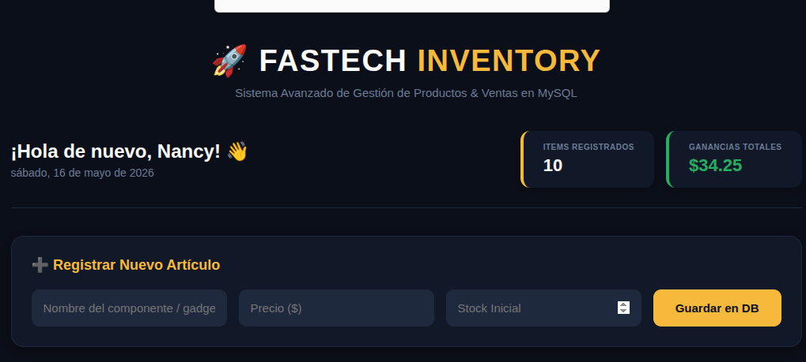
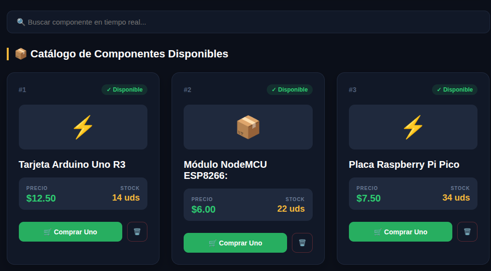
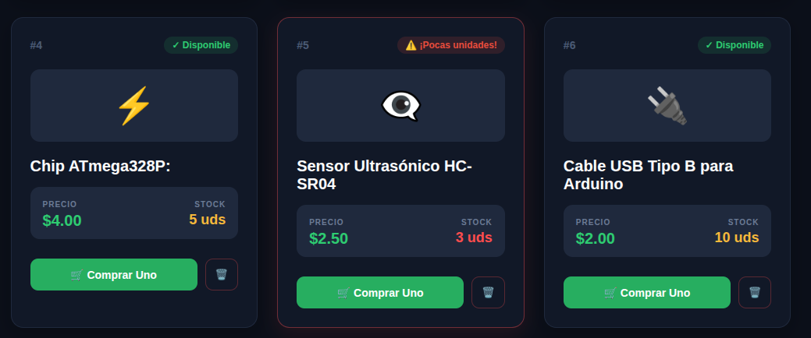
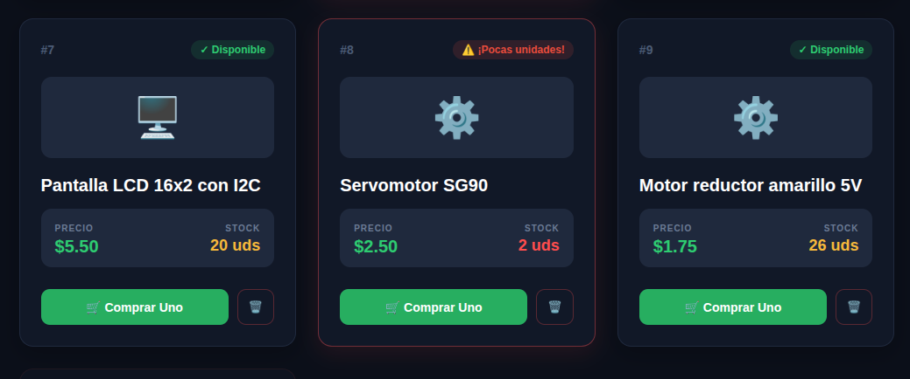
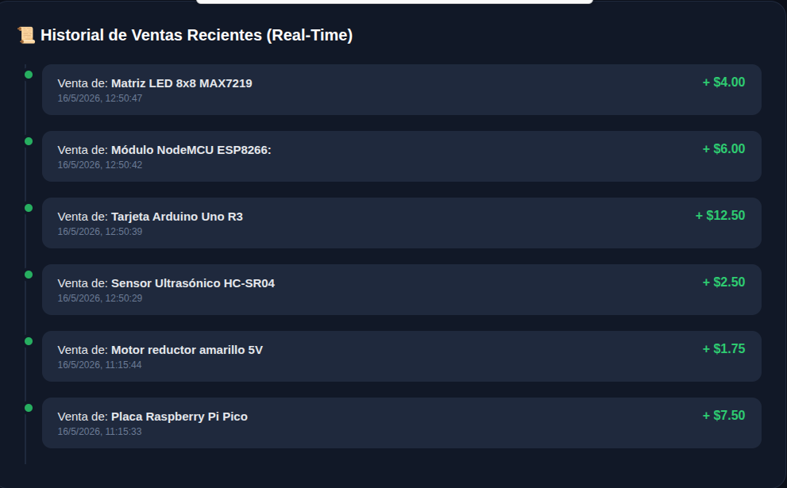
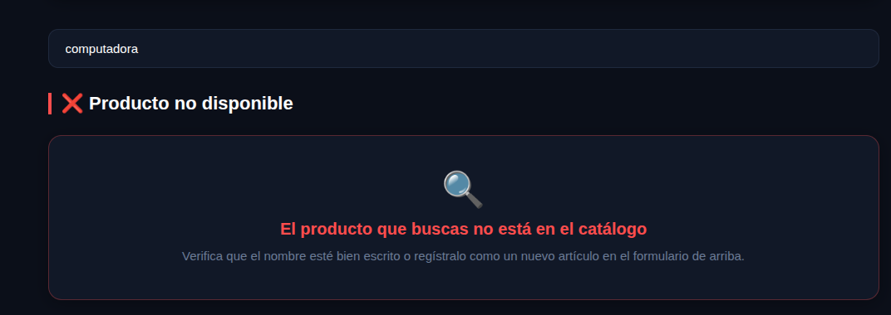
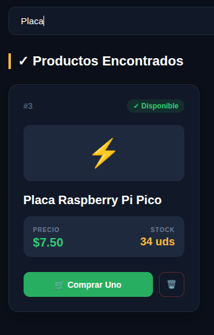

# Fastech 🚀

**Fastech** es una aplicación web full-stack desarrollada como proyecto técnico. La plataforma está diseñada para ofrecer una solución digital ágil y eficiente para la gestión de registros y control de procesos.

El proyecto implementa una arquitectura cliente-servidor, asegurando la comunicación fluida entre la interfaz de usuario y la lógica del servidor, con un almacenamiento de datos relacional optimizado.

---

## 📸 Capturas de Pantalla

> ¡Explora la interfaz de Fastech en acción! *(Recuerda añadir tus imágenes en una carpeta llamada `img` dentro del proyecto).*

| Vista Principal / Login | Panel de Control (Dashboard) |
| :---: | :---: |
|  |  |
|  |  |
|  |  |
|  |  |

---

## 🛠️ Tecnologías Utilizadas

El ecosistema tecnológico de **Fastech** refleja las herramientas reales utilizadas en su desarrollo:

*   **Backend:** Python 🐍 con **Flask** (Microframework para el manejo de rutas y lógica de negocio).
*   **Base de Datos:** **MySQL** 🗄️ (Modelo relacional para la persistencia e integridad de los datos).
*   **Entorno de Desarrollo:** **Linux (Ubuntu)** 🐧 utilizando entornos virtuales para el aislamiento de dependencias de Python.
*   **Control de Versiones:** **Git & GitHub** 🐙 para el seguimiento del código y documentación del repositorio.
*   **Frontend:** HTML5 y CSS3 (para la estructura y diseño visual de las vistas).

---

## 🚀 Características Principales

*   ⚡ **Conexión Eficiente:** Integración directa entre Flask y la base de datos MySQL para la consulta de información.
*   📊 **Gestión de Registros:** Capacidad para manejar y mostrar datos almacenados dinámicamente.
*   Routing Limpio:** Estructura de rutas bien definidas para la navegación del sistema.

---

## 📝 Notas del Proyecto
Desarrollado con fines educativos y prácticos, aplicando metodologías de desarrollo de software, estructuración de bases de datos y despliegue local en entornos Linux.
